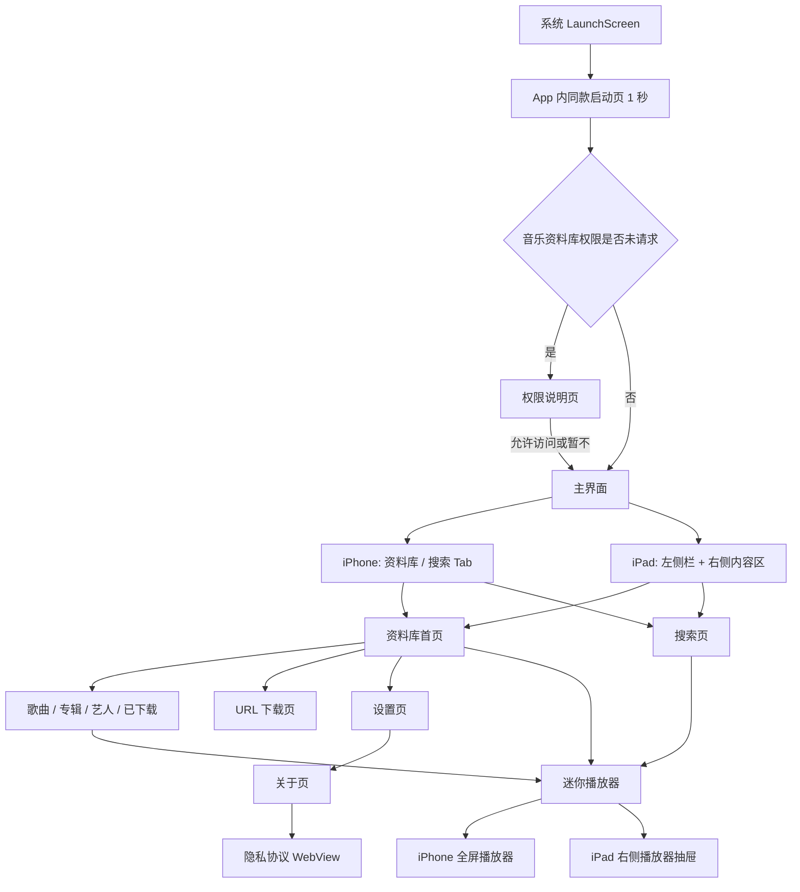

# SimpleMusic 页面与功能说明

> 文档日期：2026-08-21
>
> 代码基线：`main` / `037b0ec`
>
> 适用设备：iPhone、iPad
>
> 最低系统：iOS 15.0
>
> 界面方向：仅竖屏

本文档按照当前代码说明 App 已实现的页面、入口、交互、状态和设备差异。历史设计稿中尚未接入生产流程的内容不列为已完成功能。

## 1. 页面总览

| 页面或组件 | iPhone | iPad | 主要入口 |
| --- | :---: | :---: | --- |
| 系统启动页 | ✓ | ✓ | 点击 App 图标 |
| App 内启动过渡页 | ✓ | ✓ | 系统启动页结束后自动显示 1 秒 |
| 音乐资料库权限说明页 | ✓ | ✓ | 首次启动且权限未请求 |
| 资料库首页 | ✓ | ✓ | iPhone 底部 Tab / iPad 左侧栏 |
| 分类歌曲列表 | ✓ | ✓ | 资料库的歌曲、专辑、艺人、已下载卡片 |
| 搜索页 | ✓ | ✓ | iPhone 底部 Tab / iPad 左侧栏 |
| 迷你播放器 | ✓ | ✓ | 选择歌曲后显示 |
| 完整播放器 | 全屏 | 右侧抽屉 | 点击迷你播放器 |
| URL 下载页 | 底部弹页 | 底部弹页 | 资料库右上角下载按钮 |
| 下载不可用页 | ✓ | ✓ | 下载存储初始化失败时 |
| 设置页 | 导航 push | 右侧内容导航 push | 资料库右上角设置按钮 |
| 关于页 | ✓ | ✓ | 设置 → 关于 |
| 隐私协议 WebView | ✓ | ✓ | 关于 → 隐私原则 |

## 2. 导航结构

## 3. 启动与权限

### 3.1 系统启动页

- 使用 `LaunchScreen.storyboard`。
- iPhone 和 iPad 共用同一套品牌启动布局。
- 系统启动页由 iOS 管理，不执行网络、数据库或权限逻辑。

### 3.2 App 内启动过渡页

- 系统启动页结束后，App 会继续显示同一个 `LaunchScreen` 页面 1 秒。
- 1 秒结束后才进入权限说明页或主界面。
- 该页面用于避免系统启动页结束后立即闪入首页。
- 路由只执行一次，异步回调不会重复创建根页面。

### 3.3 音乐资料库权限说明页

显示条件：`MPMediaLibrary` 权限状态为“未请求”。

页面内容：

- 音乐图标、标题、权限用途说明。
- “允许访问”按钮。
- “暂不”按钮。
- 音频直链下载提示。

操作行为：

- **允许访问**：触发系统 Apple Music / 媒体资料库权限弹窗；系统回调后进入主界面。
- **暂不**：不请求系统权限，直接进入主界面。
- 两个按钮只接受第一次点击，防止重复进入主界面。
- 即使用户拒绝或权限受限，仍可进入主界面并使用本地下载歌曲。

## 4. iPhone 主界面

### 4.1 底部 Tab Bar

包含两个 Tab：

- **资料库**：歌曲浏览、分类、下载入口和设置入口。
- **搜索**：按歌曲、艺人或专辑搜索当前资料库。

资料库与搜索页共享同一个 `LibraryViewModel`，系统歌曲、本地歌曲、删除结果和权限变化会同步到两个页面。

### 4.2 Tab Bar 显示规则

- 资料库和搜索页显示底部 Tab Bar。
- 进入设置页后隐藏 Tab Bar。
- 从设置页返回资料库后自动恢复 Tab Bar。
- 全屏播放器通过 modal 展示，不依赖 Tab Bar 导航栈。

## 5. iPad 主界面

### 5.1 双栏布局

- 左侧为固定 264pt 侧栏。
- 侧栏包含 App 名称、资料库和搜索入口。
- 右侧内容区在资料库与搜索导航栈之间切换。
- 两个导航栈只创建一次，重复点击侧栏不会重建页面或丢失导航状态。

### 5.2 iPad 迷你播放器引导

- 选择歌曲后，右侧内容区底部显示迷你播放器。
- 用户尚未打开过右侧播放器时，迷你播放器上方显示一次性引导气泡。
- 气泡无边框，底部箭头向下指向迷你播放器。
- 点击迷你播放器并真正打开右侧播放器后，引导状态写入 `UserDefaults`，以后不再显示。

### 5.3 右侧播放器抽屉

- 点击迷你播放器后，从屏幕右侧滑入 324pt 宽的播放器抽屉。
- 抽屉复用完整播放器页面，不维护第二套播放状态。
- 点击播放器关闭按钮或左侧遮罩均可关闭。
- 打开时启用无障碍模态焦点，关闭后焦点返回迷你播放器。
- 开启“减少动态效果”时不执行滑入/滑出动画。

## 6. 资料库首页

### 6.1 导航栏操作

| 操作 | 功能 |
| --- | --- |
| 下载按钮 | 打开 URL 下载任务页 |
| 设置按钮 | 打开设置页 |

### 6.2 状态提示区

资料库顶部会按实际状态显示提示：

- 系统音乐资料库尚未授权。
- 系统音乐读取失败。
- 本地下载歌曲读取失败。
- Core Data 持久存储降级警告。
- 系统歌曲与本地歌曲都为空。

系统来源和本地来源并发加载，任一来源先完成即可先显示，不必等待另一来源。较早刷新产生的迟到结果不会覆盖最新页面状态。

### 6.3 分类卡片

| 分类 | 内容 |
| --- | --- |
| 歌曲 | 系统歌曲和已下载歌曲的合并列表 |
| 专辑 | 按专辑名分组；点击专辑进入该专辑歌曲列表 |
| 艺人 | 按艺人名分组；点击艺人进入该艺人歌曲列表 |
| 已下载 | 只显示 URL 下载到本机的歌曲 |

### 6.4 最近添加

- 展示当前系统歌曲与本地歌曲的合并结果。
- 点击某一行，以当前“最近添加”区域作为播放队列并从所选歌曲开始。
- 当前代码没有额外按照添加日期重新排序，显示顺序由系统来源和本地来源返回顺序决定。

### 6.5 歌曲行

- 显示封面、歌曲名、艺人和专辑。
- 无封面时，浅色模式显示红色音符，深色模式显示白色音符。
- 已下载歌曲显示“已下载”标识和更多操作按钮。
- 系统歌曲不显示删除入口。

### 6.6 删除本地歌曲

- 点击已下载歌曲的更多按钮后显示确认弹窗。
- 确认后只删除 App 下载目录内对应文件及 Core Data 索引。
- 不允许通过该入口删除系统媒体库歌曲。
- 删除完成后刷新共享资料库，资料库、搜索和已打开的分类页同步更新。

## 7. 分类歌曲列表

所有分类复用同一个列表页面。

### 7.1 顶部操作

| 按钮 | 功能 |
| --- | --- |
| 全部播放 | 使用当前列表作为队列，从第一首开始 |
| 随机播放 | 将当前列表随机排列后，从第一首开始 |
| 排序 | 每次点击依次切换歌曲名、艺人、专辑排序 |

### 7.2 专辑与艺人分组

- 专辑页先显示专辑名称和歌曲数量。
- 艺人页先显示艺人名称和歌曲数量。
- 点击分组后进入该专辑或艺人的实时歌曲列表。
- 页面持续订阅共享资料库；新增、删除或权限变化后会重新筛选和分组。

### 7.3 播放队列

- 点击歌曲时，当前页面显示的完整列表成为播放队列。
- 播放全部、随机播放和排序后的点击均使用最新列表，而不是打开页面时的旧快照。

## 8. 搜索页

- 搜索范围：歌曲名、艺人名、专辑名。
- 搜索忽略大小写和变音符号差异。
- 输入为空时显示全部歌曲。
- 没有歌曲时显示资料库为空提示。
- 有输入但无匹配时显示无结果提示。
- 点击结果后，以当前搜索结果作为播放队列并从所选项开始。
- 已下载歌曲可从搜索结果中进入删除确认流程。
- 资料库刷新后自动重新应用当前搜索词。

## 9. 迷你播放器

显示条件：当前播放快照包含歌曲。

显示内容：

- 歌曲封面或红/白音符占位图。
- 歌曲名和艺人名。
- 播放/暂停按钮。

操作行为：

- 点击播放/暂停按钮只切换当前歌曲状态。
- 点击迷你播放器其他区域：iPhone 打开全屏播放器；iPad 打开右侧播放器抽屉。
- 当前无歌曲时整个迷你播放器隐藏。

## 10. 完整播放器

### 10.1 展示内容

- 当前歌曲封面；无封面时显示较大的白色音符。
- 歌曲名、艺人、专辑。
- 已播放时间、剩余时间和进度滑块。
- 上一首、播放/暂停、下一首。
- 系统音量控制。
- 红色 AirPlay 路由按钮。
- 当前队列位置，例如“第 2 / 5 首”。

### 10.2 控制行为

- **上一首**：有上一首时切换；队列第一首时回到歌曲开头。
- **播放/暂停**：仅在播放器已经加载完成且状态为播放或暂停时可用。
- **下一首**：有下一首时切换；队列末尾停止播放并显示队列已结束。
- **进度滑块**：拖动结束时跳转；VoiceOver 等非触摸数值变化也会触发跳转。
- 用户拖动期间，定时播放进度不会把滑块抢回旧位置。
- 空状态、加载失败或无有效歌曲时禁用不适用的控制。

### 10.3 AirPlay

- 使用独立的 `AVRoutePickerView` 作为红色 AirPlay 按钮。
- `MPVolumeView` 内置的旧白色路由按钮已关闭，因此页面只显示一个 AirPlay 图标。

### 10.4 页面形式

- iPhone：全屏 modal，点击左上角向下箭头关闭。
- iPad：位于右侧抽屉，点击关闭按钮或遮罩收起。

## 11. URL 下载页

### 11.1 页面入口和生命周期

- 从资料库右上角下载按钮打开。
- 以带导航栏的底部 page sheet 展示。
- 关闭页面只停止页面订阅，不取消下载任务。
- 再次打开页面会显示同一个应用级队列及最新状态。

### 11.2 添加下载

- 输入或粘贴 HTTP / HTTPS 音频文件直链。
- URL 必须有合法主机和系统支持的音频文件扩展名。
- 响应必须是 HTTP 2xx，并返回系统识别的音频 MIME 类型。
- 文件落盘后还会通过 AVFoundation 读取音频元数据，网页、视频或损坏文件不会加入资料库。
- 支持格式由当前 iOS 的 AudioToolbox 能力动态决定；不同系统版本可能不同。
- 页面占位文案中的 MP3、M4A、WAV 是常见格式示例，不代表代码只支持这三种格式。

### 11.3 下载任务列表

每个任务显示文件名、状态、进度及当前可用操作。

| 状态 | 页面显示 | 可用操作 |
| --- | --- | --- |
| 等待中 | 等待中 | 取消 |
| 下载中 | 百分比和进度条 | 取消 |
| 成功 | 已添加到资料库 | 立即播放、移除任务记录 |
| 失败 | 对应错误说明 | 重试、移除 |
| 已取消 | 已取消 | 重试、移除 |
| 已中断 | 中断或恢复错误说明 | 重试、移除 |

补充规则：

- 进度依赖服务器提供可计算的总字节数；服务器不提供总长度时无法显示准确百分比。
- “移除”成功任务只移除下载任务卡片，不删除已经加入资料库的音乐；资料库内删除需通过歌曲更多操作确认。
- “立即播放”只消费一次，防止快速重复点击产生多次播放动作。

### 11.4 并发与顺序

- 最多同时下载 3 个任务。
- 第 4 个及后续任务进入等待状态。
- 空出槽位后按照用户添加或重试顺序继续。
- 每个任务独立更新进度、取消、失败和成功状态。
- 取消中的底层文件事务会先完成回滚，再释放并发槽位，避免重试与旧任务同时操作同名文件。

### 11.5 自动播放

- 设置开启时，在没有其他未完成任务的情况下提交的单个任务可在成功后自动播放。
- 多任务排队不会让每个完成任务依次抢占当前播放。
- 设置关闭时，成功任务停留在列表中，可手动点击“立即播放”。

### 11.6 页面关闭、后台和进程终止

- **关闭下载页面**：下载继续。
- **App 进入后台**：使用普通 `URLSession`，只在 iOS 允许的后台执行时间内继续；不是后台下载会话。
- **强制结束 App、系统终止进程或设备重启**：未完成任务不会断点续传。
- 下次启动后，原等待中或下载中的任务标记为“已中断”，进度归零。
- 用户点击重试后从头重新下载。
- 已完成歌曲已经写入本地文件和 Core Data，不依赖下载任务卡片继续存在。

## 12. 下载不可用页

当 App 无法创建或访问下载存储目录时：

- 下载入口显示“下载不可用”页面和具体说明。
- 不使用临时目录冒充持久下载目录。
- 系统音乐资料库浏览和系统歌曲播放仍可继续使用。
- 资料库顶部也会显示相应存储警告。

## 13. 设置页

### 13.1 音乐资料库权限

- 显示未请求、已拒绝、受限或已允许状态。
- 未请求时点击会发起系统权限请求。
- 已拒绝或受限时点击会打开系统设置。
- 已允许时不重复发起请求。
- 权限请求完成后刷新共享资料库。

### 13.2 允许蜂窝网络下载

- 开启：URLSession 允许使用蜂窝网络。
- 关闭：下载配置禁止蜂窝访问，只允许其他可用网络路径。
- 设置通过 `UserDefaults` 持久化。

### 13.3 下载后自动播放

- 开启：符合单任务条件的下载成功后自动播放。
- 关闭：下载完成后保留“立即播放”操作。
- 设置通过 `UserDefaults` 持久化。

### 13.4 关于入口

- 点击“关于”进入关于页。
- 快速重复点击不会重复 push 多个关于页。

## 14. 关于页

页面内容：

- 正式 App Logo。
- App 名称和简介。
- 从 `CFBundleShortVersionString` 读取的当前版本号。
- “系统音频格式”简短说明。
- 隐私原则说明。

页面支持纵向滚动，辅助字号放大后仍可查看全部内容。

## 15. 隐私协议 WebView

- 从关于页的隐私原则卡片进入。
- 在 App 内部 `WKWebView` 打开，不跳转外部浏览器。
- 当前地址：`https://disktoneweb.dengcheez.workers.dev/privacy`
- 支持网页前进/后退手势。
- 返回按钮由当前导航控制器提供。

## 16. 全局播放能力

### 16.1 播放来源

- 系统音乐使用 `MPMusicPlayerController` 相关系统能力播放。
- 下载歌曲使用本地 `AVPlayer` 后端播放。
- 系统歌曲与本地歌曲可以出现在同一队列中。
- 跨来源切歌时先停止旧后端，再启动新后端，避免两个播放器同时出声。

### 16.2 队列行为

- 选择歌曲时，当前页面列表成为队列。
- 播放完成后自动进入下一首。
- 队列末尾停止，并保留“队列已结束”展示。
- 随机播放只在开始时生成一次随机队列，上一首/下一首沿该固定顺序移动。

### 16.3 系统远程控制

App 启动后台音频服务后，支持：

- 锁屏和控制中心显示歌曲名、艺人、专辑、封面、时长和进度。
- 播放、暂停。
- 上一首、下一首。
- 跳转到指定播放位置。
- 耳机或其他系统媒体控制设备触发相同操作。

远程命令会根据当前播放状态和队列边界返回成功或失败，不会在空队列、加载中或失败状态下伪执行播放操作。

## 17. 数据刷新与持久化

### 17.1 自动刷新时机

- iPhone / iPad 主界面首次加载。
- App scene 再次变为 active。
- 系统媒体资料库发生变化。
- 权限请求完成。
- 下载成功或删除本地歌曲。

同时到达的多个刷新请求会合并，避免重复并发查询；必要时在当前刷新结束后再补一次最新刷新。

### 17.2 本地歌曲数据

- 下载文件存放在 App 的 Application Support / Downloads 受控目录。
- Core Data 保存歌曲 ID、文件名、标题、艺人、专辑、时长和原始下载 URL。
- 原始下载 URL 当前只持久化，不在页面中展示。
- App 启动读取本地歌曲时会检查文件存在、非空、非符号链接、为普通文件且可播放。
- 明确缺失或不可播放的文件会清理无效索引；权限错误或未知 I/O 错误不会误删记录。

### 17.3 Core Data 降级

- 持久数据库加载失败时不删除原数据库。
- App 改用内存数据库继续启动，并在资料库显示警告。
- 内存模式的数据不会冒充已经持久保存的数据。
- 保存失败会记录日志和通知，不会直接导致 App 崩溃。

### 17.4 下载队列账本

- 未完成任务会写入 Application Support 中的队列账本。
- 成功任务不写入下次启动账本，因为歌曲已进入资料库。
- 账本损坏时，本次运行降级为空的内存队列，并保留原损坏文件，不覆盖用户诊断证据。

## 18. 本地化与辅助功能

### 18.1 语言

- 跟随系统语言。
- 支持英文、简体中文、繁体中文。
- 不匹配支持语言时使用英文兜底。
- App 名称、权限说明、页面文案和复数歌曲数量均有本地化资源。

### 18.2 Dynamic Type

- 主要标题、正文、按钮、歌曲行、迷你播放器、设置和关于页使用系统文字样式。
- 关于页和权限页支持滚动，避免辅助字号下内容被压缩。
- 歌曲行和迷你播放器会根据文字高度自适应。

### 18.3 VoiceOver 与触控

- 主要按钮、下载任务操作、歌曲行、播放器进度和 AirPlay 具有辅助功能标签。
- 主要操作触控区域不小于约 44pt。
- iPad 播放器抽屉打开时作为无障碍模态区域处理。
- 播放器滑块支持 VoiceOver 数值调整触发 seek。

## 19. 当前产品边界

以下能力不应从现有页面理解为已经完成：

- 下载任务不使用后台 `URLSession`，App 被终止后不能断点续传。
- 下载页面不解析音乐平台分享页、普通网页或需要登录/鉴权的媒体页面。
- “接下来播放”区域只显示当前队列位置，不列出后续歌曲标题。
- 原始下载 URL 已保存到 Core Data，但没有查看、复制或重新下载的页面入口。
- 仅支持竖屏；iPad 采用 `UIRequiresFullScreen`，尚未完成多窗口、分屏和全部方向适配。
- 系统媒体库授权、云端歌曲、后台播放、锁屏控制、耳机控制和 AirPlay 的真实设备体验仍需发布前真机验收。
- 可下载格式随 iOS 系统能力变化，不保证每个服务器对同一种格式都返回正确扩展名、MIME 或可读取的音频内容。

## 20. 页面验收建议

### iPhone

1. 冷启动，确认系统启动页和 App 内 1 秒过渡页连续。
2. 分别验证允许访问和暂不进入主界面。
3. 检查资料库四个分类、最近添加和搜索。
4. 播放系统歌曲与下载歌曲，检查迷你播放器和全屏播放器。
5. 验证进度拖动、上一首、下一首、音量和 AirPlay。
6. 添加 4 个下载任务，确认前三个并发、第四个等待。
7. 关闭并重新打开下载页，确认任务仍继续且进度保留。
8. 进入设置，确认 Tab Bar 隐藏；返回后恢复。
9. 检查关于页 Logo、版本号和内置隐私协议。

### iPad

1. 冷启动，确认启动页不是黑屏且内容适配 iPad 竖屏。
2. 检查 264pt 左侧栏和资料库 / 搜索切换。
3. 选择歌曲，确认迷你播放器和首次引导气泡出现。
4. 点击迷你播放器，确认 324pt 右侧播放器抽屉打开。
5. 确认只有一个红色 AirPlay 图标。
6. 通过关闭按钮和遮罩分别关闭抽屉。
7. 检查下载弹页、设置弹窗、关于页和隐私 WebView。

### 下载恢复

1. 添加多个下载并观察独立进度。
2. 分别验证取消、重试、移除和立即播放。
3. 下载中关闭页面，确认任务继续。
4. 下载中强制结束 App，重新启动后确认任务为“已中断”。
5. 点击重试，确认从 0 开始重新下载。
